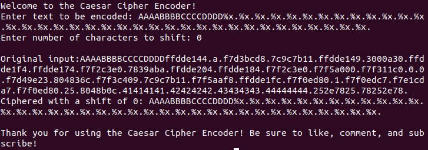
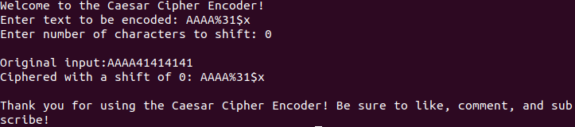
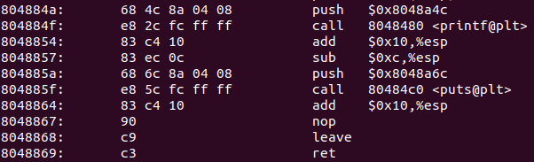
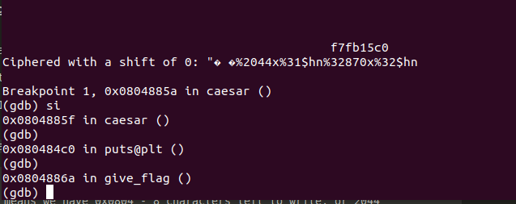
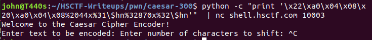
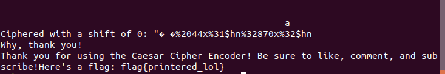

# Caesar (Binary Exploitation, 300 points)

This writeup requires some background explanation. [Click here to skip that and get straight to the writeup!](./README.md#writeup)

## What are we trying to do? How does this exploit work?

Our objective is to call `give_flag`. However, there are no buffer overflows to exploit here. Instead, we have to turn to a **GOT overwrite**. Now, I'll provide a quick primer here, as usual, but to really learn about the GOT/PLT table, I suggest visiting these links:


* [LiveOverflow GOT/PLT Table Explanation](https://www.youtube.com/watch?v=kUk5pw4w0h4)
* [Grant Curell - What is the GOT?](http://grantcurell.com/2015/09/21/what-is-the-symbol-table-and-what-is-the-global-offset-table/)
* [!HELPFUL! PicoCTF 2017 config_console writeup by \_py](https://0x00sec.org/t/picoctf-write-up-bypassing-aslr-via-format-string-bug/1920)

Most programs are compiled *dynamically*, which means that the executable uses your machine's local libraries, instead of packing its own. Because referencing an absolute memory location is impossible when compiled dynamically, *offsets* to functions are stored in a Global Offset Table (GOT), where an absolute memory address can be calculated by finding (base) + (GOT_offset). 

While the program is running, if a function `func` is called, the compiler will translate this into a call `func@plt`. Instead of jumping to the unknown location of `func`, a short code stub at `func@plt` either *points to the GOT entry for func* or resolves the location of `func` through the GOT entry.

Therefore, if we can overwrite the GOT entry for a function, when this function is called we can redirect output to a location of our choosing, and therefore call `give_flag`!

-----

The other half of this exploit is a **format string exploit**. Helpful links provided below:

* [StackOverflow Explanation](https://stackoverflow.com/questions/7459630/how-can-a-format-string-vulnerability-be-exploited)
* [Syracuse University Slides on Format String (diagrams!)](http://www.cis.syr.edu/~wedu/Teaching/cis643/LectureNotes_New/Format_String.pdf)
* [Code Arcana: Format String Exploits](http://codearcana.com/posts/2013/05/02/introduction-to-format-string-exploits.html)
* [!HELPFUL! PicoCTF 2017 config_console writeup by \_py](https://0x00sec.org/t/picoctf-write-up-bypassing-aslr-via-format-string-bug/1920)

Recall that arguments for method calls are placed on the stack right before they are called, e.g. `printf("%s", buf)` will cause `%s` and `buf` to be pushed onto the stack, then popped once `printf` is called. The important line in this exploit is the improper use of `printf(input)`. If an attacker were to input `%x %x %x %x %x` as a string, **a single** argument of `%x %x...` will be pushed onto the stack. However, printf is *dumb*, and when it gets the string `%x...`, it will think it has *five* inputs, and **pop five arguments off the stack, leaking arbitrary stack data**.

Printf also has the `%n` specifier, which will write <number of bytes before> to the address listed by %n. For example, if you have `printf("<0x1337 bytes>%n", loc_in_memory);`, \*loc_in_memory will contain the value 0x1337 after the printf call.

We now have both a read primitive (read stack data) and a write primitive (write anywhere). Let's use this to construct our exploit.

## Writeup

Again, we are provided source code for this problem, so let's investigate that first. This program is longer, so I have truncated it to the most important parts.

```
<snip>
void caesar() {
<snip>

    printf("Enter text to be encoded: ");
    fgets(input, 250, stdin);

<snip>

    //compared to other printf calls, this is *different* and therefore suspicious!
    printf("\nOriginal input:");
    printf(input);
	
	<snip>
}

void give_flag(char* s) {

<snip>
```

Aha! There is a malformed printf call, allowing us to execute a format string attack. First, let's locate our input on the stack (the reasoning behind this will become apparent later).



Here's proof that printf is leaking values from the stack :) We're specifically looking for values 0x41414141, 0x42424242, and so on because *that's what we put in as input* before leaking data. Near the end, we count that "41414141" is the 31st input on the stack. We can verify this by outputting only the 31st input on the stack with `%31$x`. **Note that '$' is a special character in a shell, so it must be escaped with a backslash '\\' every time it is used in a script!** As input, however, it is treated as raw text.



Great! As we recall from the above articles, we can now write *anything we want* to an address we input. We also know that our input is placed on the 31th argument of the stack. If we overwrite a GOT function, then we can theoretically control where the GOT entry redirects to, and get program control!

...but which function? Some function has to be called after this malformed printf call to jump to give_flag, after all.

```
* Code from https://stackoverflow.com/a/16374718 */
    while (input[i] != '\0') {
        if (input[i] >= 'A' && input[i]<='Z') {
            char newletter = input[i] - 'A';
            newletter += shift;
            newletter = newletter % 26;
            input[i] = newletter + 'A';
        }
	if (input[i] >= 'a' && input[i]<='z') {
            char newletter = input[i] - 'a';
            newletter += shift;
            newletter = newletter % 26;
            input[i] = newletter + 'a';
        }
        i++;
    }
    printf("Ciphered with a shift of %d: %s", shift, input);
    printf("\nThank you for using the Caesar Cipher Encoder! Be sure to like, comment, and subscribe!\n");
}
```

As it turns out, the only calls that happen after our input are *printf* and *exit*. If we overwrite printf, we'd end up breaking the printf call in give_flag() and never be able to get our flag:

```
    fscanf(flagFile, "%s", flag);
    printf("Here's a flag: %s\n", flag);
```

We could also overwrite exit(), but the function I chose to overwrite was puts(). "What puts()?" you might ask. "I only see printf!"

**When printf is called with only a string as input (not a variable!), it gets optimized to puts().**

In fact, this harkens back to [HSCTF 2017's Never Say Goodbye.](https://jakobdegen.gitbooks.io/hsctf-4-writeups/content/solutions/exploitation/400-never-say-goodbye.html) We can verify this by looking at the disassembly with `objdump -d caesar`:



We are correct! The second printf() call gets optimized to puts() when run by the machine. Let's overwrite the GOT entry of puts() so that when puts() is called, instead of redirecting the program to puts() in libc, it'll redirect flow to give_flag. We can find the GOT entry location by running `objdump -R caesar | grep puts`.

```
0804a020 R_386_JUMP_SLOT   puts@GLIBC_2.0
```

0x0804a020 is where puts is located. Note that this exploit will also work for exit().

One last thing: the specificer "%<number>x" in printf will pad its input to <number> characters. For example, if we type "A%2005x", the program will take the input "A" and pad it with 2005 bytes. Now, let's begin constructing our exploit! Right now, our exploit looks like this: `\x20\xa0\x04\x08%134514794x%31$n`, where we write the value **0x8048862 (address of give_flag)** bytes to the 31st item on the stack, which is the address of puts@got.

A problem immediately arises. We are writing over **134 million** characters to stdin! How can we cut this down? Solution: *use %hn instead of %n*. %hn writes to a half word, e.g. 0x4344 instead of 0x41424344. By doing this, we can split up our data into 0x804 and 0x8862, much more reasonable numbers. Of course, this means that we have to write directly to the 4 higher bytes of the GOT entry, since we can only write 4 bytes.

If a memory location 0x41414141 contains value 0x41424344, then taking the halfword at 0x41414141 will return 0x4344. However, taking the value at 0x414141*43* will literally shift the memory over 2 bytes, and will return 0x4142.

Let's split up our input in this fashion. Our payload now looks like `\x22\xa0\x04\x08\x20\xa0\x04\x08%2044x%31\$hn%32870x%32\$hn`. To break this down:

1. `\x22\xa0\x04\x08\x20\xa0\x04\x08`: We place the addresses we want to write to on the stack. In this case, the higher 2 bytes of puts@GOT are at the 31st position on the stack, and the lower 2 bytes are at the 32nd position.
2. `%2044x%31\$hn` Note that *we have written 8 bytes already with our addresses!*. This means we have 0x0804 - 8 characters left to write, or 2044 characters. We pad these in with `%2044x`, then write this halfword to the higher 2 bytes of puts@GOT.
3. `%32870x%32\$hn` Our first input totaled 0x804 characters total, so we need 0x8862 - 0x0804 more characters, or 32870. We pad these, then write to the two lower bytes of puts@GOT.

Now, when we call puts() at the very end, we should instead redirect to give_flag! Let's test it out.

```
0x0804885a <+575>:	push   $0x8048a6c
0x0804885f <+580>:	call   0x80484c0 <puts@plt>
```

Let's place a breakpoint with `b *0x0804885a`, right before our hijacked puts() call, and step through with `si` to see where we get taken.



Success! We can see that once we step to puts@plt, we redirect to our "GOT entry", which actually points to give_flag! Let's try it out through netcat.



Whoops! We forgot to provide input for the Caesar cipher itself. Append a "\n0\n" to the payload to simulate pressing enter after your input with a shift of 0:



#### Flag: `flag{printered_lol}`
