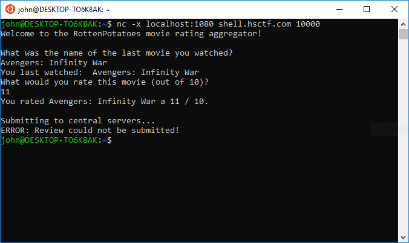
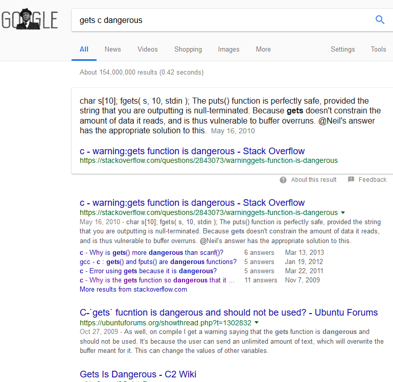
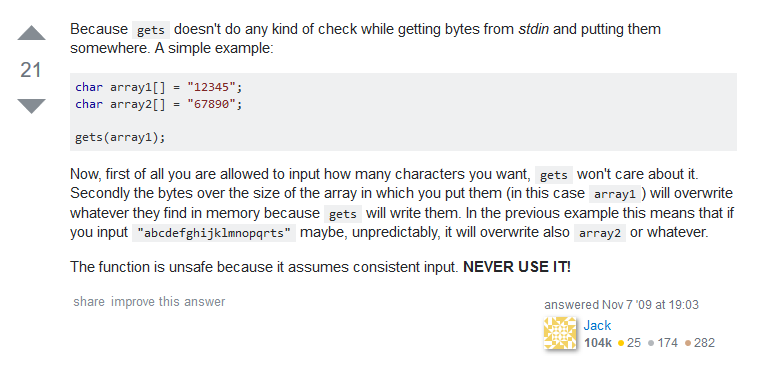
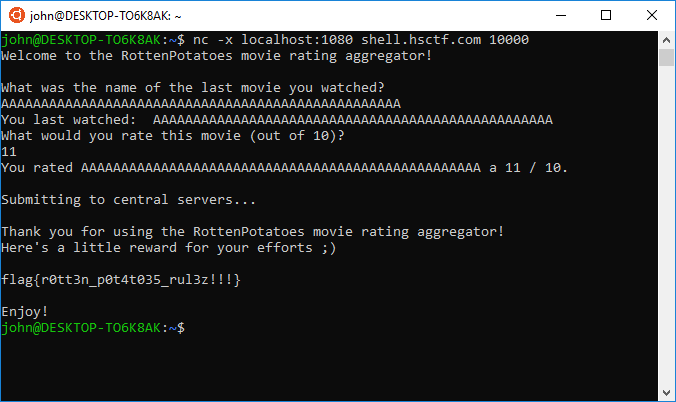
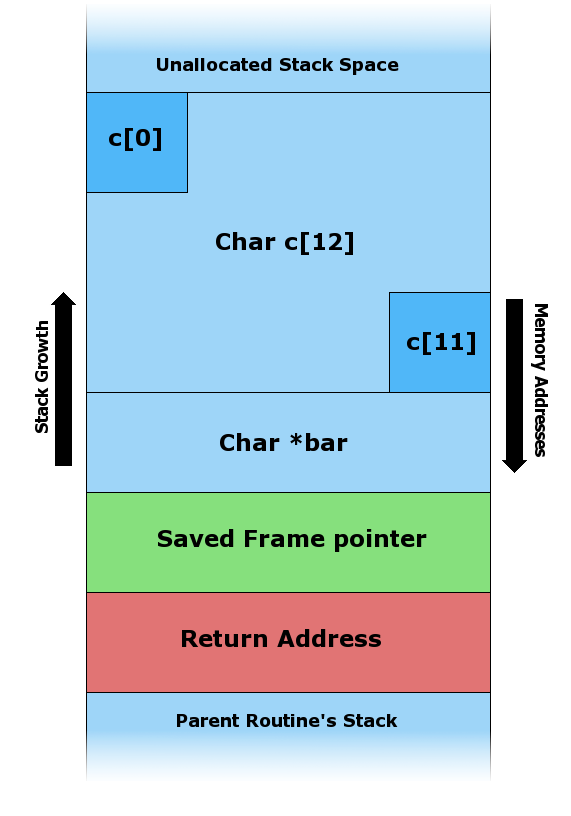
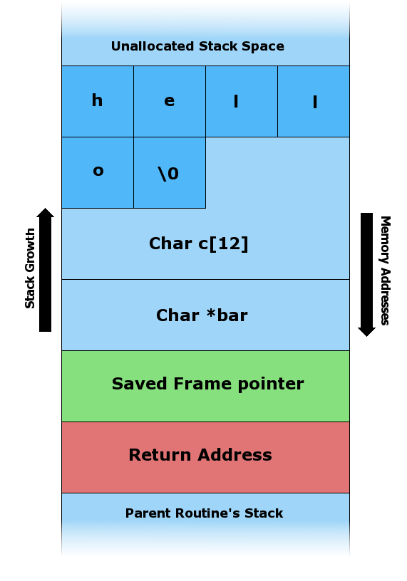

# Review (Binary Exploitation, 100 points)

We are given a netcat link, a Linux binary, and source code. What is Binary Exploitation anyway? According to Trail of Bits, 
```
Binary exploitation is the process of subverting a compiled application such that it violates some trust boundary in a way that is advantageous to you, the attacker.
```

So we're supposed to exploit this program in some way. First, let's try netcatting to the program and testing an input. Note: the `-x localhost:1080` is just a proxy that I'm using.



Submitting failed? Let's open up the source code and start analyzing. Here's a sample annotation that someone who's only taken Java *might* write:

```
// are these import statements?
#include <stdlib.h>
#include <stdio.h>
#include <string.h>

//main(String[] args), the program must start from here
int main(int argc, char **argv) {

	//no idea what this does...let's ignore it for now
	setbuf(stdout, NULL);
	gid_t gid = getegid();
	setresgid(gid, gid, gid);

	//variable declarations. valid is set to 0
	int valid = 0;
	char buffer[32];
	int rating;

	//Asking for input
	puts("Welcome to the RottenPotatoes movie rating aggregator!\n");
	puts("What was the name of the last movie you watched?");
	
    //receive input??
    gets(buffer);
    
    //must be, this prints our input like System.out.printf
	printf("You last watched:  %s\n", buffer);
    
    //request decimal input
	puts("What would you rate this movie (out of 10)?");
	//fflush(stdout);
    
    //research this, seems to take in some input for a rating, must be a number?
	if (scanf("%d", &rating) != 1) {
		puts("Invalid rating.\n");
		exit(0);
	}
    
    //print our input again
	printf("You rated %s a %d / 10.\n", buffer, rating);
	
    puts("\nSubmitting to central servers...");
	//we must make valid (which was originally 0) something else!
    if (valid) {
		puts("\nThank you for using the RottenPotatoes movie rating aggregator!");
		puts("Here's a little reward for your efforts ;)\n");
        
        //get flag!!
		system("/bin/cat /home/ctfadmin/HSCTF-Problems/review/flag");
		puts("\nEnjoy!");
	} else {
		puts("ERROR: Review could not be submitted!");
		exit(0);
	}
}

```

Let's do some research. If our job is to exploit a bug in the program, then the bug must be triggered by something we input. Otherwise, we would have gotten the flag by just running the program! Maybe one of the functions gets() or scanf() is dangerous in some way. Let's try googling `gets c dangerous`...



Yikes. I guess this is where our problem lies? Let's dig into one of the links and read some answers.



Interesting! Apparently we can overwrite other memory locations because **gets() doesn't check the size of the input**, resulting in overflows. Let's try just inputting a bunch of characters and seeing what we can overflow



#### Great! While we may not know how we've done it, we've got the flag, which is `flag{r0tt3n_p0t4t035_rul3z!!!}`.

-----

## Why does this work?


In C, when you declare variables, they're placed on the program's *call stack*. Essentially, the program will allocate its variables in a data structure called a "stack". Imagine placing your hand out in front of you, palm up. Pil some imaginary papers on your hand. At any given point, without moving your hand, you only have access to the topmost paper of the stack, given the fact that you can't flip through the papers on your hand. In a C program, the call stack houses the frame pointer, **return address**, and **arguments**.

The stack initially looks like this.



When we place an input into the stack, it now looks like this:



Finally, when we place an input that's *too large* through gets(), it can look like this:


Notice that everything "under" the character is overflowed. Since C places variables on the top of the stack, the code:

```
int valid = 0;
char buffer[32];
```

Means that `valid` is placed on the stack *before* `buffer` is. Returning to the palm analogy, you place a paper representing `valid` onto your palm first, THEN `buffer`, resulting in `buffer` being "on top of" `valid`. Your input then starts from the top side of the topmost paper and penetrates downwards, overwriting other papers underneath it. Thus, by overwriting `buffer` with gets(), we can actually leak into `valid`'s data! In C, there are no booleans -- `0` means `false`, and anything that's not 0 means `true`. 

Therefore, we can overwrite valid by entering more than 32 characters (in reality a bit more) for the title of the movie, which means that valid gets overwritten with a nonzero value, thus making our review "valid" and getting us the flag!

[Source for images here. The article is also a good introduction to buffer overflows.](https://en.wikipedia.org/wiki/Stack_buffer_overflow)