# ASM Writeup (Reverse Engineering, 400 points)

We are greeted with a long string that seems to be simply gibberish. I notice immediately that there are equals signs at the end of the string, which signifies to me that this string is base64 encoded. A quick google for "equals sign at end of string" confirms this, so we base64 decode it to reveal...

```
c2263250000000663a60008139e0038f7dad6a783a4036733da0008039a010803dc000503e800f3666103063332664463024512006421302544214565564414624651225242442040564554321360104650655135112211166163033651125561112056221111413034333013641045425015435156055446056501524650216221645223243322005511251612234601130634511452022331343515554603236512151222061262121102135100565543216140263211135256302515161021234646235143115103100341616636512241525620131500236332500506333561553303060506460633050323226013a6007b73a40367348000008600000003ec000003ac000003ee000003ae000003f0000003b0000003f2000003b2000003f4000003b4000003f6000003b6000003f8000003b8000003fa000003ba000006b9cdbca6ef7c0016af711006f390c006f5a5e606ad633566b3930306fbd55556f186b6b6af7b4b36b5a3abe6f9c7c7c6b7b2eef6b1800856af7b4b36ed642456f7b36546bbd21b26ef71abb6ef7c0013f39d41f3b18c32d3f1800a63ad6af0c3b9c8c623ef7aea73f5a00003b390d0b3f9c00003b5ab8743af7deda3f7bb06b3fbde9e23b7bb6433bbddd443ed6ec1f48000004480001357da802a6a26d00105673803f39ad0004a1ed000a39ad0000a20d000c39adffff7e158378a20d00015610803f7e10ab7839ad0008a22dffffa28d000339ad000139adfffda2adfffb56ae803f39adffffa2adfffa7dd57214a2adfffe7e73ab7839ad0004a2ad000056b2803e480000c57da802a639adfffca2ad000a7e52ab7839ad000a7e358b78a22d00025631803e7e358a147df57b7839ad0002a1ed000055ef803e7defab787e95a378a28dfff85694803e7eb4a378a2adfff856b5803ea1adfffa7db56a14480000047c0db000408200407c0eb800408200387c0fc000408200307c10c800408200287c11d000408200207c12d800408200187c13e000408200107c14e8004082000848000014480000217da802a639ad00144800003c480000117da802a639ad001c4800002c4e8000211048013d1083112101010101199223131010999977726f6e67210000436f6e67726174736000000000000000
```

Helpful...not. What even is this?

It looks like hex, so let's try decoding it.

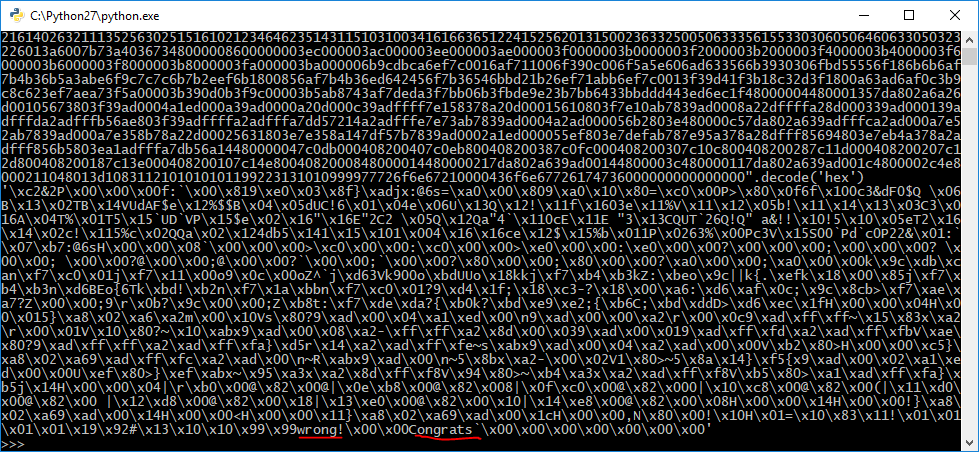

I see "wrong" and "Congrats", so we're making progress, but basically nothing else decoded properly. Where do we go from here? 

Let's take another look at the problem. In the description, Keith says the string is encoded twice, once with "special ASM". We just deduced that Base64 was the first encryption, so this string must be encoded with "special ASM". Let's google the quoted strings "special ASM" and "wiird".

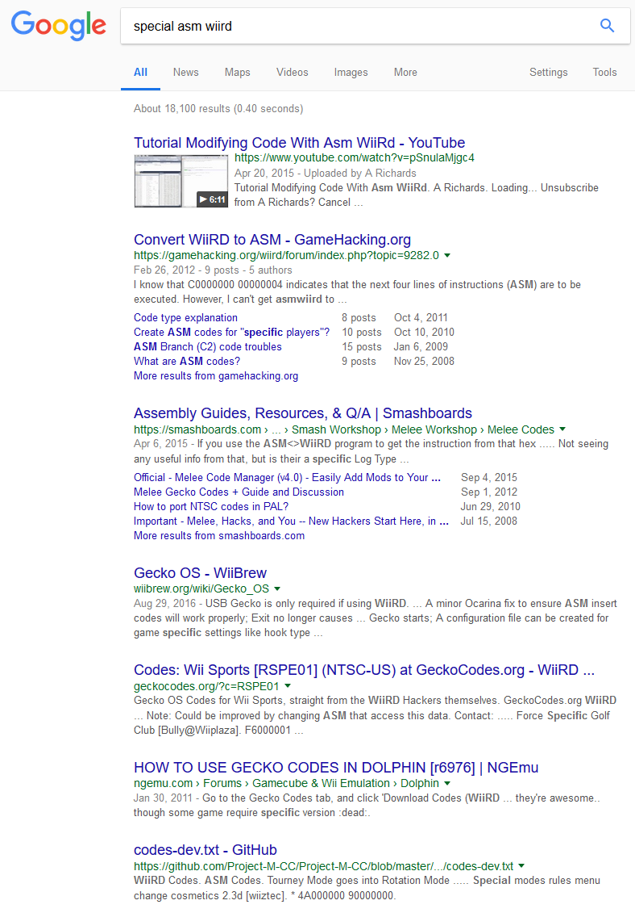

Interesting! Doing some more research, it seems that this is a Gecko Code, which are cheats injected into Wii games. Looking through some of the results, we find [this tweet](images/twitter.png) by Dan Salvato claiming that he uses ASMWiird to assemble his *assembly*. Great! Let's download ASMWiird and...oh, [ASMWiird is from 2011](images/asm.png), located in the now-deprecated code.google.com repositories, and doesn't appear to run! Maybe there's an updated download somewhere?

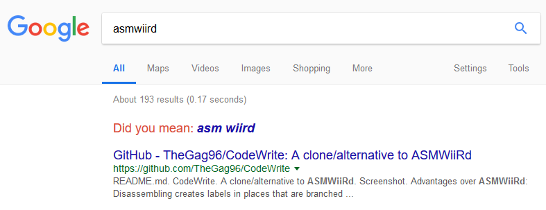

Oh.

Let's paste our code in, and...

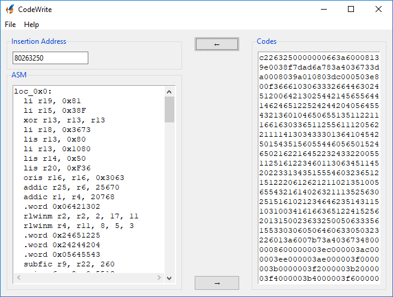

Success! We now know we're working with...something, but at least it's decoded? Let's google some keywords we've found.

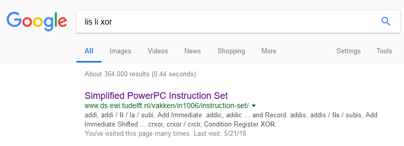

So we're working with PowerPC assembly. Let's dive into the code here after skimming the manual. We find a bunch of instructions and `.word`s, let's skip those for now because I just found something more interesting:

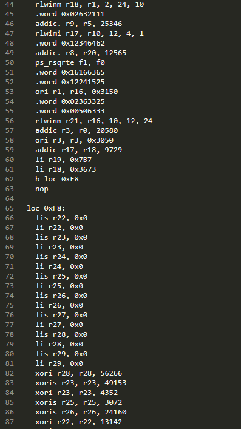

So it seems that the program takes inputs in registers r22-r29 and then performs a whole bunch of xor and subtraction on our inputs. Something interesting to note is that PowerPC instructions can usually only operate with an immediate 4 byte value; this is what `xoris` and other instructions do. They take a register and xor the top 4 bytes with an immediate value. Let's skip [the next section](images/asm3.png) since it looks as complicated as the first one.

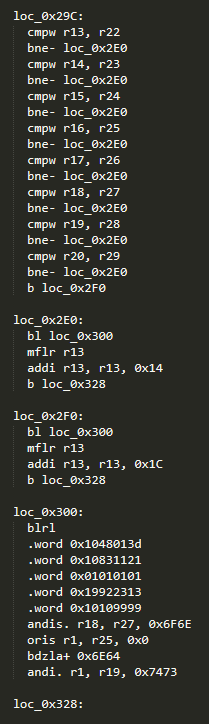

This looks like the flag verification code with two branches, presumably to tell us if we're wrong or right. We see the `bne` (branch if not equal) instruction pointing to `loc_0x2E0`, so we can presume that that's the "false" code. Then `loc_0x2F0` must be the "true" code, and `loc_0x300` seems to be...constants? 

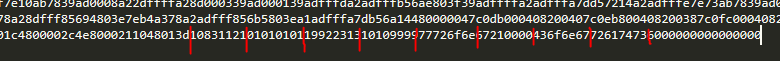

Seems that the constants got incorrectly disassembled, as there is our "wrong" and "Congrats" in their full hex-encoded glory. Let's rename that and see what `wrong` and `right` are doing:

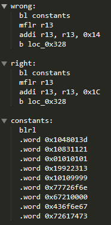

So, by looking into the PowerPC manual we find that `bl` is a branch with return (like `call` in x86) and `blrl` is the return (like `ret`). What's important to note here is that `blrl` places the instruction 4 bytes ahead in the link register, as can be seen in [this secondary manual](http://www.plantation-productions.com/Webster/www.writegreatcode.com/Vol2/wgc2_OB.pdf). The next instruction is the beginning of the .word layer! By running `mflr r13`, we get an arbitrary pointer to this array! We can confirm this by adding 0x14 to the position of r13 manually and seeing if it matches up with our "wrong" string. [It does!](images/asm7.png)

Now, we're prepared to tackle the [third portion of the code](images/asm8.png). By analyzing and reading the manual, we see that we create the array pointer in r13 again, the load in various values from offsets to this pointer. By reading the manual, we find out that `rlwinm` rotates registers left by a certain amount, so this shifts the 4 lower bytes of a register into the top 4 bytes. Armed with this knowledge and some *incredibly annoying* math, we get these values for r13-r20:

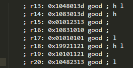

Now, we can finally tackle the top portion of [xors and subis](images/asm10.png). In general, the formula seems to be `input register XOR input SUBI input = output register`. After doing more math, we come up with these values:


Turning this into a single string `666c61677b6733636b305f63306433355f6172335f7374316c6c5f757333647d` and decoding as hex yields the flag.

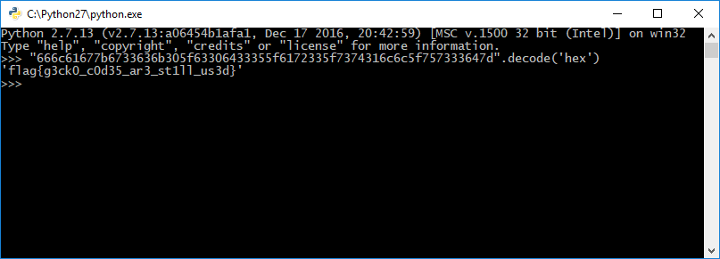

#### Flag: `flag{g3ck0_c0d35_ar3_st1ll_us3d}`